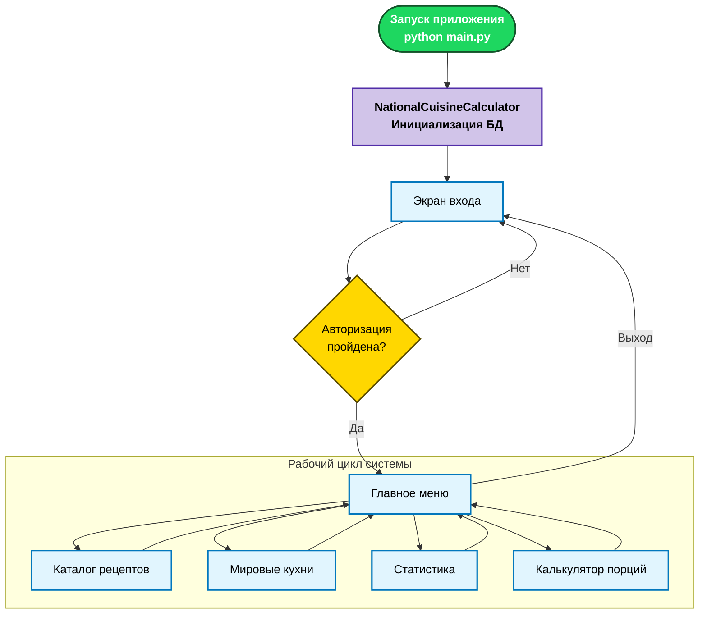
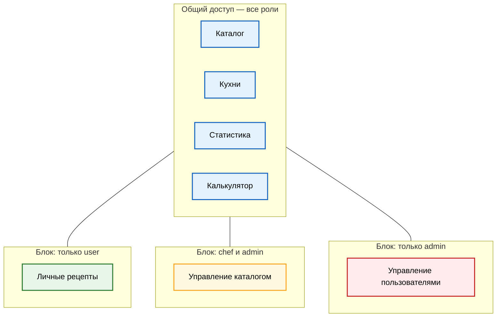
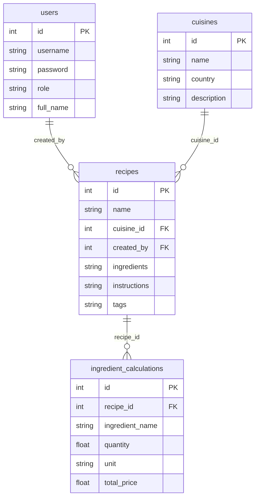

# 🍽️ National Cuisine Calculator  
## Калькулятор национальной кухни

**Курсовая работа**  
**Студентка:** Аль-Фахдави Ф. Х.А.  
**Группа:** 841-М23  

---

## Оглавление

| №  | Раздел | Описание |
|----|--------|----------|
| 1  | [Постановка задачи](#1-постановка-задачи) | Описание — что делает приложение, для чего оно создано |
| 2  | [Цели и задачи](#2-цели-и-задачи) | Функциональные и нефункциональные задачи |
| 3  | [Используемые технологии](#3-используемые-технологии) | Язык, фреймворк, СУБД, библиотеки |
| 4  | [Функциональные возможности](#4-функциональные-возможности) | Полный перечень возможностей по модулям |
| 5  | [Система ролей и прав доступа](#5-система-ролей-и-прав-доступа) | Матрица доступа admin / chef / user |
| 6  | [Многоязычная поддержка](#6-многоязычная-поддержка) | Описание системы i18n (RU/AR/EN) |
| 7  | [Требования и установка](#7-требования-и-установка) | Установка Python, зависимости, запуск |
| 8  | [Учётные записи по умолчанию](#8-учётные-записи-по-умолчанию) | Тестовые аккаунты для демонстрации |
| 9  | [Структура репозитория](#9-структура-репозитория) | Дерево файлов проекта |
| 10 | [Архитектура модулей](#10-архитектура-модулей) | Таблица файлов и их ответственности |
| 11 | [Описание алгоритма](#11-описание-алгоритма) | Схема работы расчёта и навигации |
| 12 | [База данных — схема и таблицы](#12-база-данных--схема-и-таблицы) | Описание таблиц, связей, миграций и демо-данных |
| 13 | [Диаграммы](#13-диаграммы) | Поток клиента, роли, ER-диаграмма |
| 14 | [Перенос проекта](#14-перенос-проекта) | Инструкция по запуску на другом ПК |
| 15 | [Проверка и тестирование](#15-проверка-и-тестирование) | Команды проверки, сценарии тестирования |
| 16 | [Известные ограничения](#16-известные-ограничения) | Текущие ограничения системы |
| 17 | [Соответствие академическим требованиям](#17-соответствие-академическим-требованиям) | Как проект удовлетворяет условиям курса |
| 18 | [Примеры входных и выходных данных](#18-примеры-входных-и-выходных-данных) | Образцы документов и структуры данных |
| 19 | [Руководства пользователя](#19-руководства-пользователя) | Ссылки на подробные инструкции |

---

## 1. Постановка задачи

**«Калькулятор национальной кухни»** (National Cuisine Calculator) — это программный комплекс для автоматизации процесса управления рецептами и расчёта необходимых запасов продуктов.

### Что делает приложение

Приложение предоставляет единую среду для **хранения, просмотра и расчёта рецептов** из 15 национальных кухонь мира. Пользователь может:

- **искать рецепты** по названию, кухне, сложности и категории;
- **просматривать карточку рецепта** с полным описанием, ингредиентами и пошаговой инструкцией;
- **пересчитывать количество ингредиентов** под нужное число порций/людей с помощью встроенного калькулятора;
- **получать примерную стоимость** набора продуктов на основе справочника цен;
- **создавать собственные рецепты** (личные или для общего каталога — в зависимости от роли);
- **просматривать статистику** — отчёты по кухням, видам рецептов и калорийности;
- **экспортировать** рецепт с расчётом в текстовый файл (для печати).

### Для кого предназначено

Приложение ориентировано на широкий круг пользователей:
- **студенты** кулинарных специальностей (справочник рецептов);
- **домашние повара** (расчёт продуктов на нужное количество гостей);
- **учебные проекты** (демонстрация архитектуры: Tkinter + SQLite + модульная структура + RBAC + i18n).

### Основные технические характеристики

| Параметр | Значение |
|----------|----------|
| **Язык** | Python 3.10+ |
| **GUI-фреймворк** | Tkinter (стандартная библиотека) |
| **СУБД** | SQLite 3 (один файл `database.db`) |
| **Архитектура** | Модульная (MVC-подобная): core / database / recipes / calculator / cuisines / stats / users |
| **Кухни** | 15 национальных кухонь мира |
| **Демо-рецепты** | ~35+ рецептов |
| **Роли** | admin, chef, user (RBAC) |
| **Языки интерфейса** | Русский 🇷🇺, Арабский 🇸🇦, Английский 🇬🇧 |
| **Безопасность** | SHA-256 хеширование паролей |

---

## 2. Цели и задачи

### Функциональные цели

1. Создать интерактивный каталог рецептов с фильтрацией по кухне, сложности и категории.
2. Реализовать калькулятор пересчёта ингредиентов пропорционально числу порций.
3. Обеспечить ролевое разграничение доступа (администратор, шеф-повар, обычный пользователь).
4. Поддержать трёхъязычный интерфейс (русский, арабский и английский).
5. Автоматически заполнять базу демо-рецептами при первом запуске.
6. Предоставить модуль статистики с агрегированными отчётами.

### Нефункциональные цели

1. Переносимость — приложение работает на Windows, macOS и Linux без внешних серверов.
2. Автономность — вся логика и данные хранятся локально в одном файле БД.
3. Простота развёртывания — установка сводится к `python main.py`.
4. Модульность кода — каждый функциональный блок в отдельном пакете/файле.

---

## 3. Используемые технологии

| Технология | Роль в проекте | Версия |
|------------|----------------|--------|
| **Python** | Основной язык программирования | 3.10+ |
| **Tkinter** | GUI-фреймворк (стандартная библиотека Python) | встроен в Python |
| **ttk (Themed Tkinter)** | Стилизованные виджеты (кнопки, таблицы, комбобоксы) | встроен в Python |
| **SQLite 3** | Реляционная СУБД (встроенная, безсерверная) | встроен в Python |
| **hashlib (SHA-256)** | Хеширование паролей | встроен в Python |
| **Pillow** | (Опционально) Загрузка и превью изображений рецептов | ≥ 10.0.0 |

---

## 4. Функциональные возможности

### 4.1. Каталог рецептов

| Функция | Описание |
|---------|----------|
| **Поиск по названию** | Поиск по подстроке (`LIKE`) в имени рецепта |
| **Фильтр по кухне** | Выпадающий список всех кухонь из справочника |
| **Фильтр по сложности** | `легко`, `средне`, `сложно` |
| **Фильтр по категории** | `салат`, `суп`, `закуска`, `основное блюдо`, `десерт`, `напиток` |
| **Карточка деталей** | Полное описание, ингредиенты, инструкции, КБЖУ, фото (если есть) |
| **Двойной клик** | Быстрый переход в детали рецепта |
| **Навигация (Breadcrumbs)** | В шапке отображается текущий путь (например, Главная > Каталог) |
| **Навигация в калькулятор** | Кнопка «Рассчитать» из карточки рецепта |

### 4.2. Калькулятор ингредиентов

| Функция | Описание |
|---------|----------|
| **Выбор рецепта** | Из полного списка рецептов с привязкой к кухне |
| **Ввод числа порций** | Пересчёт всех ингредиентов пропорционально (`coefficient = portions / base_portions`) |
| **Расчёт стоимости** | Примерная стоимость на основе встроенного справочника цен (руб.) |
| **Таблица результатов** | Ингредиент, количество, единица, цена за единицу, общая стоимость |
| **Сохранение в файл** | Экспорт расчёта в текстовый файл (`.txt`) для печати |

---

## 5. Система ролей и прав доступа

### Матрица доступа

| Функция | `user` | `chef` | `admin` |
|---------|--------|--------|---------|
| Каталог рецептов (просмотр, поиск, фильтры) | ✅ | ✅ | ✅ |
| Мировые кухни (справочник) | ✅ | ✅ | ✅ |
| Статистика и отчёты | ✅ | ✅ | ✅ |
| Калькулятор ингредиентов | ✅ | ✅ | ✅ |
| Создать **личный** рецепт | ✅ | ❌ | ❌ |
| Добавить рецепт в **общий** каталог | ❌ | ✅ | ✅ |
| Редактировать / удалить рецепт | ❌ | ✅ | ✅ |
| Управление пользователями | ❌ | ❌ | ✅ |

---

## 6. Многоязычная поддержка

Приложение реализует полную интернационализацию (i18n) с поддержкой **трёх языков**:

| Язык | Код | Описание |
|------|-----|----------|
| **Русский** | `ru` | Основной язык интерфейса |
| **Арабский** | `ar` | Поддержка для арабоязычных пользователей |
| **Английский** | `en` | Международный интерфейс |

### 6.1 Архитектура системы перевода

- **Словарь переводов**: Все строки пользовательского интерфейса (182 ключа) извлечены из модулей и собраны в единый словарь `TRANSLATIONS` (`core/translations.py`).
- **Централизованный доступ**: Метод `app.get_text(key)` автоматически возвращает текст на текущем языке.
- **Динамическое переключение**: Кнопки `RU` / `AR` / `EN` доступны на всех экранах (заставка, вход, заголовок). При переключении языка **текущий экран перерисовывается без потери навигационного состояния** (`nav_stack` сохраняется).
- **Категории переведённых строк**: заголовки окон, метки форм, столбцы таблиц, фильтры, сообщения об ошибках / успехе, контекстная справка (F1), кнопки, системные диалоги.

### 6.2 Переведённые модули

| Модуль | Файл | Статус |
|--------|------|--------|
| Ядро (Вход, Регистрация, Меню) | `core/app.py` | ✅ Полностью |
| Каталог рецептов | `recipes/recipe_management.py` | ✅ Полностью |
| Калькулятор ингредиентов | `calculator/calculator_view.py` | ✅ Полностью |
| Статистика и отчёты | `stats/statistics_view.py` | ✅ Полностью |
| Управление пользователями | `users/user_management.py` | ✅ Полностью |
| Персональные рецепты | `recipes/personal_recipes.py` | ✅ Полностью |

---

## 7. Требования и установка

### Запуск
```powershell
python main.py
```
При первом запуске автоматически:
1. Создаётся файл `database.db`.
2. Создаются все таблицы (users, cuisines, recipes, ingredients, archived_recipes).
3. Загружаются демо-рецепты (~35+ рецептов).

---

## 8. Учётные записи по умолчанию

| Логин | Пароль | Роль | Права |
|-------|--------|------|-------|
| `admin` | `123` | Администратор | Полный доступ + управление пользователями |
| `chef` | `111` | Шеф-повар | Добавление/редактирование рецептов в общий каталог |
| `user` | `000` | Пользователь | Просмотр + создание личных рецептов |

---

## 9. Структура репозитория

```text
National-Cuisine-Calculator/
├── main.py                        # Точка входа (Запуск приложения)
├── core/                          # Ядро: UI, навигация, переводы
├── database/                      # База данных: Manager, сиды рецептов
├── recipes/                       # Модуль рецептов: каталог и управление
├── calculator/                    # Модуль калькулятора порций и цен
├── cuisines/                      # Справочник национальных кухонь
├── stats/                         # Модуль статистики и отчетов
├── users/                         # Управление пользователями
├── scripts/                       # Утилиты БД (тесты, проверка пользователей)
├── database.db                    # База данных SQLite (создается при запуске)
├── README.md                      # Полная документация (Отчет)
├── README.TXT                     # Краткое описание для электронного варианта
└── requirements.txt               # Зависимости Python (Pillow)
```

---

## 10. Архитектура модулей

### Таблица модулей

| Модуль | Файл | Класс/Функция | Назначение |
|--------|------|----------------|------------|
| **Запуск** | `main.py` | `main()` | Инициализация Tk root и запуск приложения |
| **Ядро UI** | `core/app.py` | `NationalCuisineCalculator` | Главное окно, стили, логин, меню, навигация |
| **БД** | `database/database.py` | `DatabaseManager` | Подключение SQLite, CRUD, архивация, хеширование |
| **Рецепты** | `recipes/recipe_management.py` | `RecipeManagement` | Каталог, детализация, редактирование, удаление |
| **Калькулятор** | `calculator/calculator_view.py` | `Calculator` | Расчёт порций, таблицы цен, экспорт в TXT |
| **Статистика** | `stats/statistics_view.py` | `Statistics` | Отчёты по кухням, калориям и категориям |
| **Пользователи** | `users/user_management.py` | `UserManagement` | CRUD пользователей (для админа) |

---

## 11. Описание алгоритма

Система построена по событийно-ориентированному принципу (Event-Driven).

### 11.1 Алгоритм расчёта ингредиентов
1. **Вход**: `target_portions` (целевое число порций), `base_portions` (базовое число порций).
2. **Шаг 1**: Расчёт коэффициента: `K = target_portions / base_portions`.
3. **Шаг 2**: Цикл по ингредиентам рецепта:
   - Парсинг строки: `имя | количество | ед`.
   - `new_quantity = количество * K`.
4. **Шаг 3**: Поиск цены за единицу в справочнике `ingredients`.
5. **Шаг 4**: `total_cost_item = new_quantity * price`.
6. **Выход**: Таблица с пересчитанными данными и итоговая сумма.

### 11.2 Алгоритм навигации и безопасности
- **Backtrack**: Система хранит стек последних функций `nav_stack`. При нажатии **Esc** функция извлекается, обеспечивая возврат на предыдущий уровень (Requirement 6).
- **Archive**: При удалении записи она сначала копируется в таблицу `archived_recipes` (soft-delete), затем удаляется из основной таблицы (Requirement 2).

---

## 12. База данных — схема и таблицы

### Таблицы

| Таблица | Описание | Ключевые поля |
|---------|----------|---------------|
| **`users`** | Пользователи системы | `id`, `username`, `password`, `role`, `full_name` |
| **`cuisines`** | Справочник кухонь (15 записей) | `id`, `name`, `country`, `description` |
| **`recipes`** | Рецепты (основная таблица) | `id`, `name`, `cuisine_id`, `instructions`, `ingredients`, `tags` |
| **`ingredients`** | Справочник базовых ингредиентов с ценами | `id`, `name`, `price_per_unit`, `unit` |
| **`archived_recipes`** | Архив удаленных рецептов | Содержит данные удаленных рецептов в формате JSON |
| **`archived_users`** | Архив удаленных аккаунтов | Содержит данные удаленных пользователей для аудита |

---

## 12. Диаграммы

> Диаграммы ниже рендерятся на **GitHub** автоматически. В VS Code используйте расширение *Markdown Preview Mermaid Support*.

---

### 12.1 Поток приложения (Tkinter + SQLite)



---

### 12.2 Меню и роли



---

### 12.3 ER-диаграмма — связи таблиц



---

## 14. Проверка и тестирование

### Сценарий тестирования

| Действие | Ожидаемый результат |
|----------|---------------------|
| Запуск `main.py` | Открытие Splash Screen, переход к логину |
| Вход (admin/123) | Доступ ко всем пунктам меню, включая Управление |
| Расчёт рецепта | Пересчёт количеств продуктов и стоимости в калькуляторе |
| Удаление рецепта | Появление подтверждения, перемещение в архив |
| Нажатие F1 | Открытие окна справки для текущего экрана |
| Нажатие Esc | Возврат на предыдущую страницу (меню) |

---

## 15. Известные ограничения

- Справочник цен на ингредиенты редактируется только через БД.
- Требуется установленный Python 3.10+.

---

## 17. Соответствие академическим требованиям

Проект разработан с учетом строгих критериев надежности и удобства:

1.  **Устойчивость (Requirement 1)**: Реализован логический контроль ввода данных. Действия, связанные с потерей информации (удаление рецептов или пользователей), требуют явного подтверждения через диалоговые окна на выбранном языке (RU/AR/EN).
2.  **Целостность данных (Requirement 2)**: Реализована система **Soft Delete**. Данные не пропадают физически, а переносятся в архивные таблицы (`archived_recipes`, `archived_users`). Использование `FOREIGN KEY` (CASCADE) обеспечивает отсутствие "висячих" ссылок.
3.  **Единство стиля (Requirement 6)**: Весь интерфейс спроектирован в едином premium-дизайне. Используются общие компоненты для шапки (Breadcrumbs), подвала (Status Bar) и кнопок.
4.  **Средства перемещения (Requirement 5/7)**:
    - **Status Bar**: Нижняя панель подсказывает активные горячие клавиши.
    - **Breadcrumbs**: В заголовке всегда виден путь навигации.
    - **Hotkeys**: Реализована глобальная поддержка **F1** (Справка) и **Esc** (Назад/Выход).
5.  **Справочная система (Requirement 7)**: По нажатию **F1** открывается контекстное окно помощи, содержимое которого меняется в зависимости от активного экрана.
6.  **Многоязычность (i18n)**: Полная интернационализация интерфейса — 182 ключа перевода, охватывающих все модули. Переключение языка (RU/AR/EN) происходит **без потери текущего состояния навигации**. Ни одна строка UI не содержит «hardcoded» русского текста — всё выводится через централизованный словарь.

---

---

## 18. Примеры входных и выходных данных

### 18.1 Входные данные (Рецепт)
В системе рецепты хранятся в нормализованном виде. Пример структуры ингредиентов:
```text
Говяжья вырезка|500|г
Лук репчатый|2|шт
Сливки 20%|200|мл
Масло сливочное|50|г
```

### 18.2 Выходные данные (Экспорт калькулятора)
Пример сгенерированного файла `recipe_calculation.txt`:
```text
========================================
ОТЧЕТ ПО РАСЧЕТУ ИНГРЕДИЕНТОВ
Рецепт: Бефстроганов
Дата: 2026-04-11 19:42:15
Количество порций: 6
========================================

Ингредиент          | Кол-во  | Ед.  | Цена/ед. | Итого
--------------------------------------------------------
Говяжья вырезка     | 750.0   | г    | 0.45     | 337.5
Лук репчатый        | 3.0     | шт   | 10.0     | 30.0
Сливки 20%          | 300.0   | мл   | 0.15     | 45.0
--------------------------------------------------------
ИТОГО К ОПЛАТЕ: 412.5 руб.

* Расчет произведен автоматически системой National Cuisine Calculator
========================================
```

---

## 19. Руководства пользователя

- [USER_GUIDE_RU.md](USER_GUIDE_RU.md) — Подробное руководство пользователя на русском языке.
- [USER_GUIDE_AR.md](USER_GUIDE_AR.md) — Подробное руководство пользователя на арабском языке.
